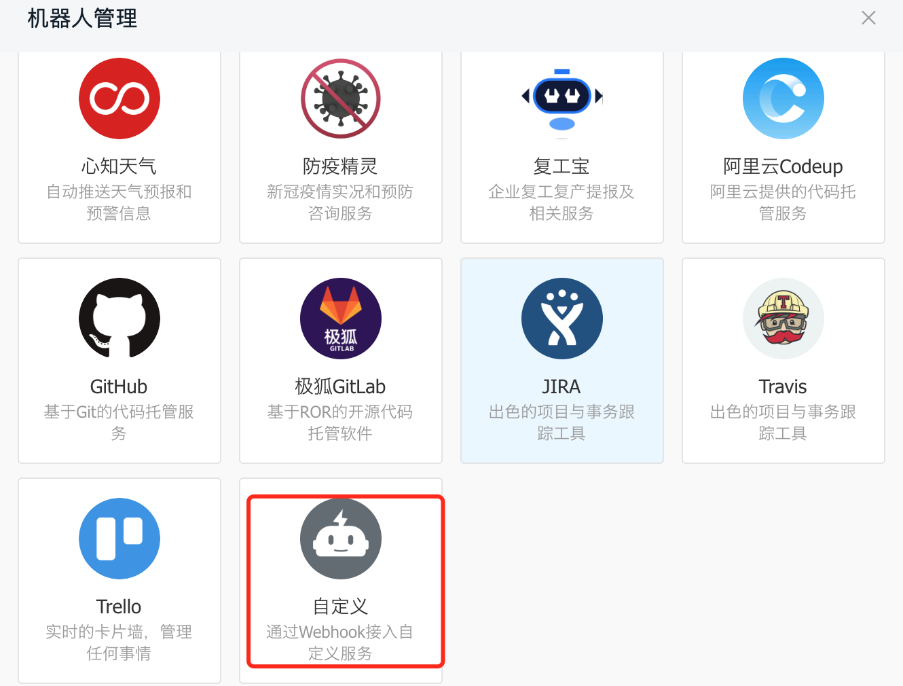
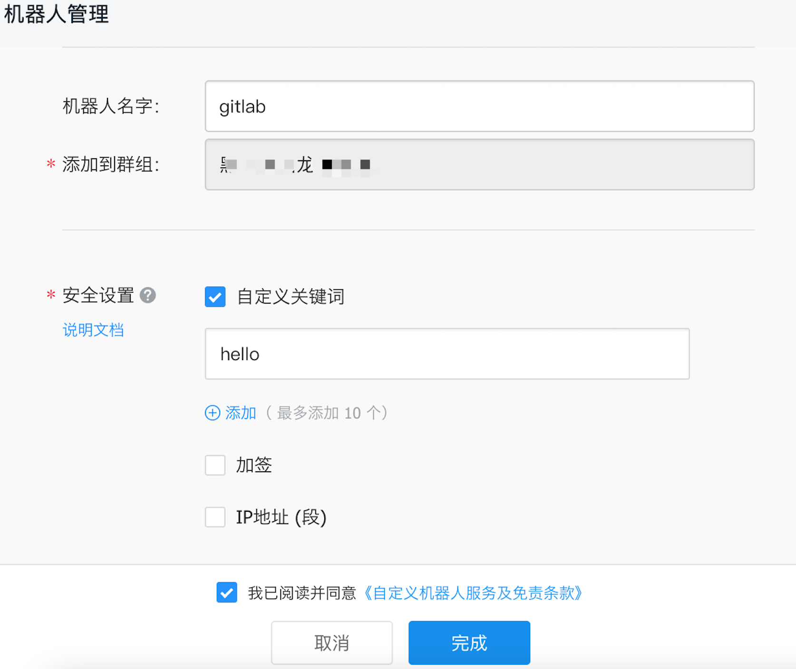
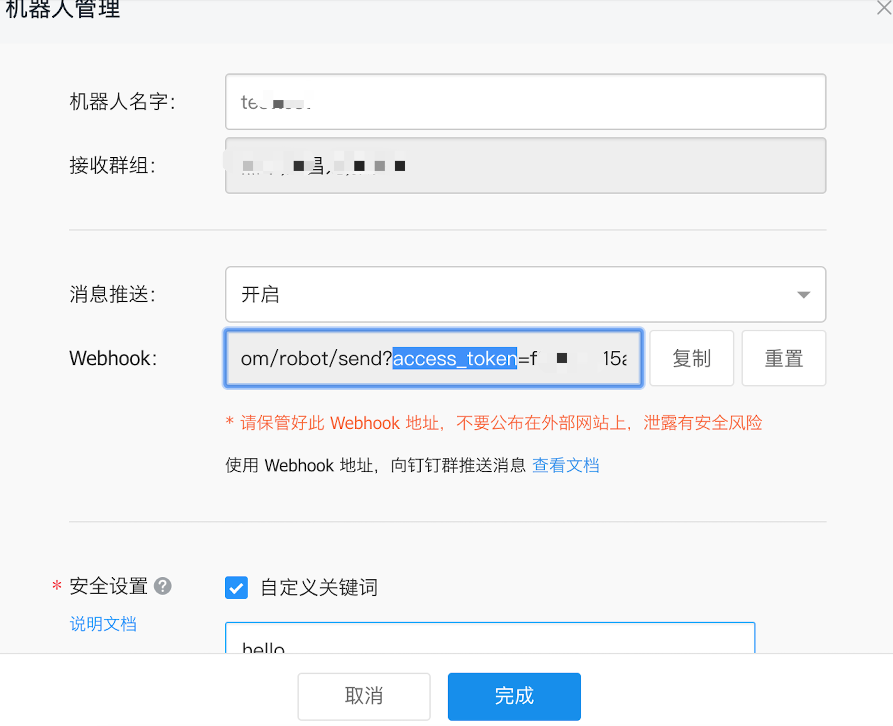
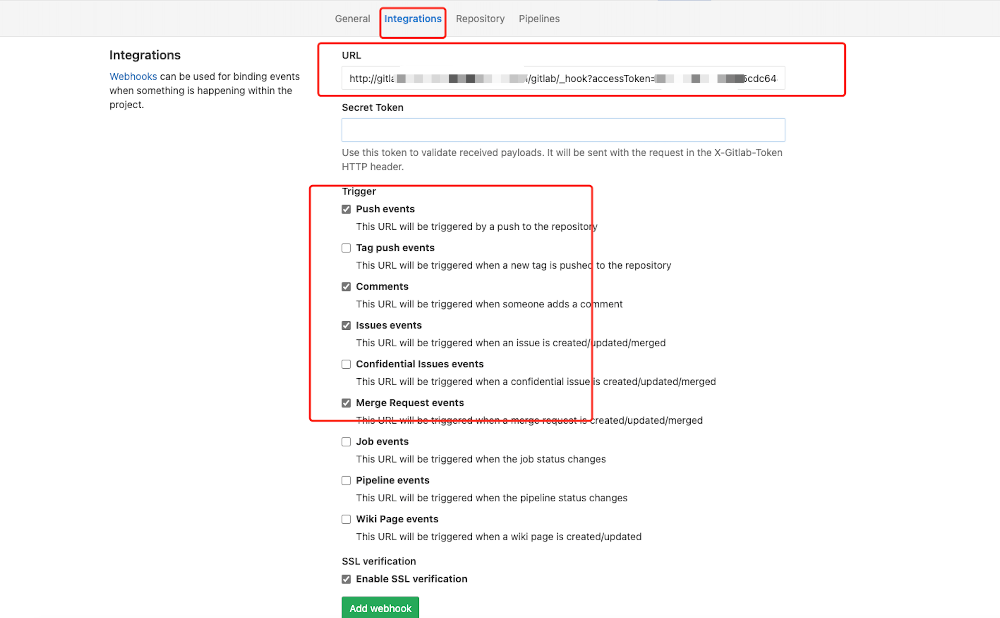

# gitlab 智能机器人

问： 为什么要开发这个？钉钉不是已经提供了 Gitlab 机器人吗？

答：因为钉钉自带的机器人，互动性不强，例如我在一段代码上评论了，但被评论的人，你不主动通知他，他就不知道。在这个场景中，就需要一个智能机器人 @他。

## 功能简介

目前支持 gitlab 的以下几种消息

* push evens  
* comments
  * 支持评论区 @ 同步钉钉 @
  * 评论 issue 默认 @issue 提出人
  * 评论 merge request 默认 @merge request 提出人
* issues events
  * @ issues 负责人
  * reopen close 等都会 @ 相关人
* merge request
  * open close reopen merge update 都会 @ 相关人
  
## 如何使用

* 配置好 `application.yaml` 中的 `gitlab.url`、`gitlab.access-token` ，方便同步钉钉用户

* 在 [application.yaml](./src/main/resources/application.yaml) 中配置 `gitlab.gitlab-to-dingtalk-users` 项，内容为 gitlab 与 钉钉手机号的映射。

* 在钉钉群中添加自定义机器人

* 配置钉钉机器人，关键字固定配置 hello

* 复制出 `access_token`, 贴在 url 后面 `http://domain.name/gitlab/_hook?accessToken=`

* 在 gitlab 相应的 repository 中，依次 Setting -> Integrations, 在 URL 中填入上步的 URL, 勾选 push events、 comments、issues events、merge request envets.

## 预览功能

